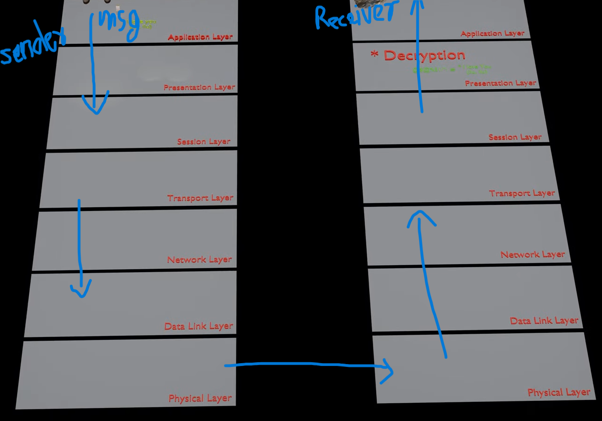

# OSI Model (Open System Interconnection)
OSI model is the model that explains how data travels from one device to another devices.
It has seven layers from where data travels.

## Seven Layers of OSI model
- Application (7th layer)
- Presentation (6th layer)
- Session (5th Layer)
- Transport (4th Layer)
- Network (3rd Layer)
- Data Link (2nd Layer)
- Physical (1st Layer)

Application , presentation and session layer are software layer

Network, Data link and physical layer are hardware layer 

Transport layer is a heart of the osi model.

## Fig : Data flow from sender to receiver

## Application Layer
Application Layer is the seventh layer where user directly interact with the application.

In this layer mobile application , web application uses different types of protocol for data transmission like: 
- http/https for websites
- Html for sending mail
- pop for receiving mails
- Ftp for file transfer etc.

### Major functions happening in this layer:
- Provides User Interface for user interaction.
- Different Services are provided for transmission.

## Presentation Layer
Presentation Layer is the sixth layer of osi model.

### Major functions happening in this layer:
- Translation: Messages are translated into machine code / binary code .
- Compression: The data is compressed to a smaller size for the fast transmission and to avoid data loses.
- Encryption : The data is encrypted(unreadable form) in order to not allowing other read the messages.
- In the receiving side , data is decrypted and translated to a human readable form.

## Session Layer
Session layer is the fifth layer of osi mode .

### Major functions happening in this layer:
- Session creation:  Session is created for data transmission.
- Session maintainance: Keeps the session live while data is transmitted .
- Session termination: Ends the session/connection after all data transmitted successfully.
- Synchronization: In this layer , Checkpoints are added in data transmission so that transmission resumes from the last checkpoints if transmission fails.

## Transport Layer
Transport Layer is the fourth layer of osi model.

### Major functions happening in this layer:
- Segmentation: Breaks down the data in smaller pieces called segments.
- Port number Addressing: Add port number to each segments to identify applications like: http= 80, https= 443.
- Error Detection and Recovery: Error should be detected. Two types of error can be detects :
  1. Normal Data loses : It can be recovered by retransmitting data.
  2. External manipulation in data: It can be recovered by adding checksum to each the data packets for uniquely recognized.
- In the receiving side, segmented data are reconstructed back to the original data.
- Protocols uses in this layer: TCP for connection oriented transmission and UDP for connection less transmission.

## Network Layer
Network Layer is the third layer of osi model.

### Major fucntions happening in this layer:
- Logical Addressing: Ip address of source and destination is attached in the data packets.
- Routing: Selecting best shortest route for data travelling .
- Data fragmentation: Large data packets break down into smaller one if need (based on network size limits).
- Sometimes fragmented packets back to the original data .
- Router is used in this layer.
Protocols used: ip(core protocol) , ICMP(error message, ping), RIP or OSPF(Routing protocols)

## Data Link Layer
DataLink layer is the 2nd layer of osi model.

### Major Functions happening in this layer:
- Physical addressing: Mac address of source and destination is attached to each data packets.
- Framming: All the elements like ip, mac, checksum in one frame for every packets.
- Error detection and recovery: Detects error in the frame using CRC and recove by retransmission.
- Flow Control: Data flow is controlled to prevent buffer overflow. It means when two devices have different capcity of sending and receiving data like A have 50 mbps but B have 100 mbps then data overflow while sending data from B to A so B also transmit data in 50 mbps to prevent this problem .
- Switch is used to send data to a data to specific devices.

This layer has two parts:
- Logical Link control: Handles error and control data flow.
- Media Access Control: Handles physical addressing and access to medium.

## Physical Layer
Physical layer is the first layer of osi model.

### Major fucntions happening in this layer:
- Conversion: Digital data is converted into a physical signals.
- Signals transmissioin: Signals are transmitted through different ways - Electrical signals(copper cable), Light signals(fiber optics), radio signals(air/wireless).
- Data rate control: Defines how fast data are transmitted.
- Physical topology: Also defines the network structure like: lan, man, wan, pan.
- Deals with hardware like: cable types, connectors, voltage levels etc.

Devices uses in this layer:
- Repeaters
- Hub
- Cables
- nic(network interface cards)