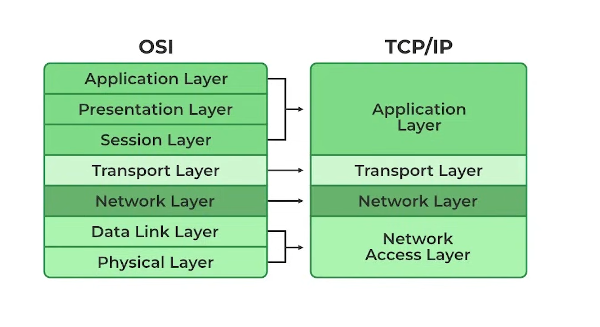

# TCP/IP model (Transmission Control Protocol/ Internet Protocol)
It has four layers . It is a practical approach . It is a integrated form of osi model.

## Four Layers of tcp/ip model
### - Application Layer
### - Transport Layer
### - Network Layer
### - Network Access Layer (data link)

## Application Layer
It is a top layer where user directly interact with the application and prepare the request for the destination.

### Major functions happening in this layer:
- User interact with the application and prepare request.
- Different protocols like http, https etc are used to request.

## Transport Layer
It is the third layer of tcp/ip model. It ensures the safety of the data.

### Major functions happening in this layer:
- Breaking down the data into small segents.
- Add port numbers with the segments.
- Ensuring data reaches safely(TCP).

## Network Layer
It is the second layer of tcp/ip model. It decides the way of data travelling.

### Major functions happening in this layer:
- Assigning the source and ip address to a data packets.
- Break down large data into small packets if needed.
- Select the best route to travel.

## Network Access Layer
It is the ground layer of the tcp/ip model where actually data travels to another device.

### Major functions happening in this layer:
- Data link Fucntions: Destination and source Mac address is attached with frame. Frame- header, data, tailer where header = mac, tailer= error detection(crc).
- physical functions: Now Frame is converted into signal (electrical, light, radio) and travel in defferent medium(copper, fiber optics, air).